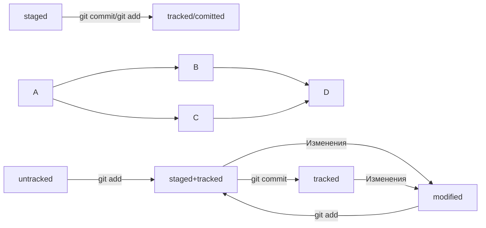

# YandexPracticum_Git

## Бесплатный курс «Основы работы с Git»

Поможем освоить популярную систему контроля версий файлов

1. Для старта не нужно никаких знаний — мы всему обучим
2. Научитесь использовать Git для совместной работы над проектами
3. Поймёте принципы работы Git и узнаете, зачем его используют
4. Будете учиться на примере реальных рабочих задач
5. Разберётесь в основах Git и работе с GitHub
6. Сможете заниматься в удобном темпе — материалы доступны 24/7

## Чему вы научитесь

* Работать над проектом вместе с другими разработчиками и разработчицами
* Работать с ветками
* Использовать локальный и удалённый репозиторий
* Объединять ветки и решать конфликты
* Управлять репозиторием через IDE и консоль
* Понимать принципы и культуру командной разработки

## Инструменты, которые вы освоите

* Git
* Terminal
* GitBASH
* GitHub

# Что нужно знать о программе

## Курс основан на реальных практических задачах
Вы сможете не просто освоить все базовые навыки работы с Git, но и разобраться, в каких рабочих задачах он используется. Вся теория подкреплена схемами и визуальными материалами — вам не придётся расшифровывать и искать информацию.

## Освоите не только инструменты
Сложность нарастает постепенно: начнём с простых команд и в итоге дойдём до решения конфликтов при совместной разработке — самой сложной части работы с Git. В процессе расскажем не только про инструменты, но и про хорошие практики и навыки коммуникации.

## Для старта нужен только компьютер с доступом в интернет
Вам не потребуются дополнительные навыки или специальные программы. Чтобы начать, нужно только зарегистрироваться или войти в существующий аккаунт Практикума — так мы сможем сохранять ваш прогресс по программе.

# Шпаргалка

### **Хеш — идентификатор коммита**

**Хеширование** (от англ. hash, «рубить», «крошить», «мешанина») — это способ преобразовать набор данных и получить их «отпечаток» (англ. fingerprint).

Информация о коммите — это набор данных: когда был сделан коммит, содержимое файлов в репозитории на момент коммита и ссылка на предыдущий, или **родительский** (англ. parent), коммит.

Git хеширует (преобразует) информацию о коммите с помощью алгоритма **SHA-1** (от англ. **S**ecure **H**ash **A**lgorithm — «безопасный алгоритм хеширования») и получает для каждого коммита свой уникальный **хеш** — результат хеширования.

Обычно хеш — это короткая (40 символов в случае SHA-1) строка, которая состоит из цифр 0 — 9 и латинских букв A — F (неважно, заглавных или строчных). Она обладает следующими важными свойствами:
* если хеш получить дважды для одного и того же набора входных данных, то результат будет гарантированно одинаковый;
* если хоть что-то в исходных данных поменяется (хотя бы один символ), то хеш тоже изменится (причём сильно).

**Хеш — основной идентификатор коммита**

Git хранит таблицу соответствий хеш → информация о коммите. Если вы знаете хеш, вы можете узнать всё остальное: автора и дату коммита и содержимое закоммиченных файлов. Можно сказать, что хеш — основной идентификатор коммита.

При работе с Git хеши будут встречаться вам регулярно. Их можно будет передавать в качестве параметра разным Git-командам, чтобы указать, с каким коммитом нужно произвести то или иное действие.

Все хеши и таблицу хеш → информация о коммите Git сохраняет в служебные файлы. Они находятся в скрытой папке .git в репозитории проекта.

### Логи

лог (от англ. log — «журнал [записей]»).

#### Элементы описания коммита
После вызова git log появляется список коммитов.
* строка из цифр и латинских букв после слова commit — это хеш коммита;
* Author — имя автора и его электронная почта;
* Date — дата и время создания коммита;
* в конце находится сообщение коммита.

#### Получить сокращённый лог — git log --oneline
Получить сокращённый лог можно с помощью команды git log с флагом --oneline (англ. «одной строкой»). В терминале появятся только первые несколько символов хеша каждого коммита и их комментарии.

### **Файл HEAD**

Файл HEAD (англ. «голова», «головной») — один из служебных файлов папки .git. Он указывает на коммит, который сделан последним (то есть на самый новый).

Внутри HEAD — ссылка на служебный файл: refs/heads/master (или refs/heads/main в зависимости от названия ветки). Если заглянуть в этот файл, можно увидеть хеш последнего коммита.

Когда вы делаете коммит, Git обновляет refs/heads/master — записывает в него хеш последнего коммита. Получается, что HEAD тоже обновляется, так как ссылается на refs/heads/master.

При работе с Git указатель HEAD используется довольно часто. Мы уже упоминали, что многие команды Git принимают в качестве параметра хеш коммита. Если нужно передать последний коммит, то вместо его хеша можно просто написать слово HEAD — Git поймёт, что вы имели в виду последний коммит.

Коммит -- это всему голова.

Статусы файлов:

